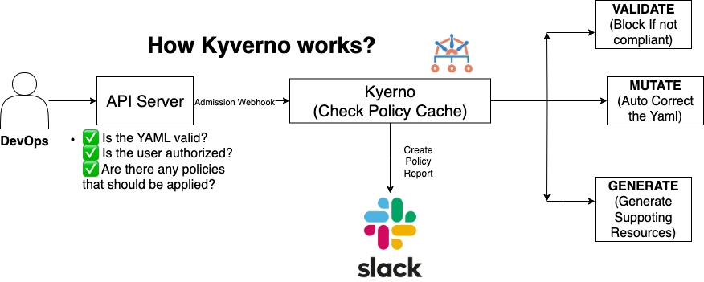

# Lesson 6: Automated Kubernetes Governance with Kyverno and Slack Alerts

This lesson demonstrates how to use [Kyverno](https://kyverno.io/) in production Kubernetes clusters to enforce policies, catch violations, and set up alerting for compliance and security.


## Objectives
- Install Kyverno with custom RBAC and controller settings
- Deploy the Kyverno UI for policy management
- Configure alerting (e.g., Slack notifications) for policy violations
- Understand and use the provided configuration files

---

## 1. Kyverno Overview
Kyverno is a Kubernetes-native policy engine that allows you to write policies as Kubernetes resources. It helps enforce best practices, security, and compliance by validating, mutating, and generating resources.

---

## 2. Files in This Lesson

- **kyverno-values.yaml**: Custom values for installing Kyverno with extended RBAC permissions for controllers. Useful for production clusters where Kyverno needs to manage or audit a wide range of resources.
- **kyverno-ui.yaml**: Configuration for enabling the Kyverno UI and setting up Slack alerting for policy violations in specific namespaces and policies.

---

## 3. Installing Kyverno with Custom Values

You can install Kyverno using Helm and the provided `kyverno-values.yaml` for production-grade RBAC:

```sh
helm repo add kyverno https://kyverno.github.io/kyverno/
helm repo update
helm upgrade --install kyverno kyverno/kyverno \
  --namespace kyverno --create-namespace \
  -f kyverno-values.yaml
```

---

## 4. Deploying the Kyverno UI

The Kyverno UI provides a graphical interface for managing policies and viewing violations. To enable the UI and alerting, apply the `kyverno-ui.yaml` configuration:

```sh
helm repo add policy-reporter https://kyverno.github.io/policy-reporter
helm repo update
helm install policy-reporter policy-reporter/policy-reporter \ 
   --create-namespace -n policy-reporter -f kyverno-ui.yaml
```

- Slack alerting is configured for the `codedevops` and `production` namespaces, and for the `require-label` policy.
- Update the Slack webhook URL in the YAML to your own workspace for real notifications.

---

## 5. Writing and Enforcing Policies

- Write Kyverno policies as Kubernetes resources (YAML files).
- Apply them to your cluster using `kubectl apply -f <policy-file>.yaml`.
- The UI and alerting will help you monitor compliance and catch violations in real time.

---

## 6. Alerting and Monitoring

- Slack alerts are sent for policy violations based on the configuration in `kyverno-ui.yaml`.
- You can customize alert channels, priorities, and filters as needed.
- Use the Kyverno UI to view policy status, violations, and audit results.

---

## 7. Cleanup

To remove Kyverno and its UI:

```sh
helm uninstall kyverno -n kyverno
kubectl delete -f kyverno-ui.yaml -n kyverno
```

---

## References
- [Kyverno Documentation](https://kyverno.io/docs/)
- [Kyverno Policies Library](https://kyverno.io/policies/)
- [Kyverno UI](https://github.com/kyverno/kyverno-ui)
- [Kyverno Helm Chart (for custom values)](https://github.com/kyverno/kyverno/tree/main/charts/kyverno)

